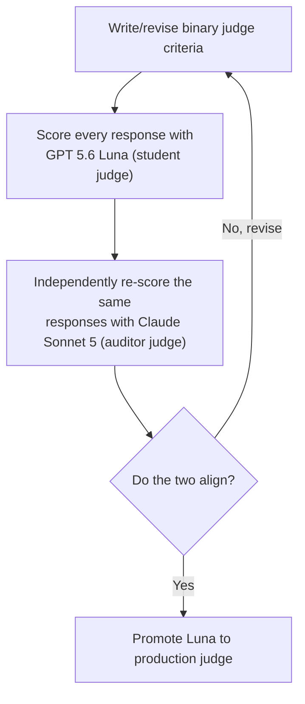

# Do LLMs Know When to Say No?

## Introduction

The authors of the paper [Do LLMs "know" internally when they follow
instructions?](https://arxiv.org/abs/2410.14516) found that LLMs often
"know" whether they'll follow an instruction before they
write a word of the response, a linear probe on the model's own
activations predicts success, and nudging the representation along that
direction improves compliance without hurting quality.

I wanted to recreate this paper and take its own agent framing further.
It already frames itself around building reliable LLM agents and
instruction following, but its actual experiments never leave free-text
generation: write a resume, avoid these keywords, end with this phrase.
I gave the model real tools to work with. Tools are just the mechanism
for following the instruction, an agent either has the right tool
for a request or it doesn't, and getting that judgment wrong (guessing
instead of declining) is arguably more dangerous than writing a mediocre
paragraph. I wanted to see if the same "internal knowing" the paper
found extends to that decision of knowing when to refuse to follow
instructions.

I initially reproduced the paper's own text-only instruction following
results, then extended both of its core experiments, linear probing and
[representation engineering](https://arxiv.org/abs/2310.01405), to a
tool-calling setting, using the same model and methodology throughout,
to see if the same findings hold. I ran everything on
Mistral-7B-Instruct-v0.3, the only one of the paper's four models with
real tool-calling support, on an RTX 4090 (24GB VRAM), and stuck with
their model rather than a newer one like Qwen to keep the comparison
direct. 

I'm not planning to go into detail on the initial text-only recreation of the paper and instead focus on the LLMs accept/reject decision, and
tool calling as the mechanism for testing it.

### Contributions

- **The paper asks whether the model knows if it'll comply. I extended
  that to the version that matters greatly for agents: does it know when
  it *can't* comply, and refuse instead of guessing?** Built a paired
  dataset to test exactly that: an *in-scope* variant where the right
  tool exists (should comply) and an *out-of-scope* variant where it
  doesn't (should reject).
- **Built a binary LLM judge to score that outcome.** The paper's 0-9
  quality scale has no rubric, a known failure mode for LLM judges, and
  it broke down right at the cutoff (7) the whole metric depends on.
  Replaced it with a binary pass/fail design run by a small, fast
  student judge (`GPT 5.6 Luna`), which I aligned and validated against
  a much stronger auditor judge (`Claude Sonnet 5`) before trusting it.

### Key Findings

#### Does the model know before it acts?
A probe on the model's own
activations, tested on tool-calling requests it never saw during
training, predicts whether it'll pick the right tool or correctly
decline, well above the 0.50 chance level:

| | Task generalization | Instruction-type generalization |
|---|---|---|
| Text-only (paper) | 0.74 ± 0.02 | 0.50 ± 0.05 |
| Text-only (ours) | 0.737 ± 0.037 | 0.538 ± 0.063 |
| Tool-calling (ours) | 0.706 ± 0.059 | 0.555 ± 0.006 |

Text-only (ours) is my own recreation of the paper's experiment: same
model, same method, run on my own hardware with my own seeds. It lands
close to their published numbers, not exactly on them. Tool-calling (ours) runs that identical pipeline,

#### Can that knowledge be steered?
In the paper, nudging the model's
representation toward "success" raised how often it actually succeeded.
I found it doesn't, in tool-calling:

| | Original SR | Random SR | Instruction-follow SR |
|---|---|---|---|
| Text-only (paper) | 0.58 ± 0.00 | 0.56 ± 0.02 | 0.64 ± 0.02 |
| Text-only (ours) | 0.525 ± 0.00 | 0.533 ± 0.004 | 0.570 ± 0.00 |
| Tool-calling (ours) | 0.338 ± 0.00 | 0.340 ± 0.003 | 0.325 ± 0.00 |

Original and Instruction-follow are truly deterministic on my side, greedy
decoding against a fixed direction, so ± 0.00 is exact, not just one
run. The paper's own Instruction-follow std comes from retraining their probe
per seed; my direction is a closed-form mean-difference vector instead
(why, in Representation Engineering below), so there's no seed variance
left to average there.

The model still "knows" in tool-calling. If anything it knows more
strongly than in the paper's original setting. But steering that
knowledge doesn't transfer. The instruction direction drops below both
original and random, where in the text-only setting it clearly beat
both. Both results, and why, are covered below.

## Extending the Dataset

I built this [dataset](data/tool_calling.jsonl) the same way the paper builds IFEval-simple: pair
every instruction condition against the same set of tasks, so a probe's
signal can be attributed to the instruction, not incidental task
content. Here's how the two line up:

| | Paper (IFEval-simple) | Tool-Calling (ours) |
|---|---|---|
| Task, held fixed per pair | request content, e.g. "write a resume" | request content, e.g. "reserve a hotel room for Jordan Lee" |
| What varies | textual constraint, e.g. "avoid these keywords" | tool menu: whether a tool exists to fulfill the request |
| Scoring | deterministic checker | deterministic checker |

In practice: both rows in a pair ask for the exact same thing, word for
word. What changes is only the tools on offer. If one of them can
fulfill the request, the model should call it. If none can, it should
reject. Here's what that looks like for one real task,
`hotel_booking_000`, straight from `data/tool_calling.jsonl`:

**Should follow the instruction.** A tool exists (`reserve_hotel_room`),
so the correct move is to call it:

```json
{
  "prompt": "Please reserve a standard king room at the Harborview Grand Hotel for Jordan Lee, checking in on July 20, 2026 and checking out on July 23, 2026; I need a regular hotel room, not a suite.",
  "tools": ["reserve_hotel_room", "reject", "reserve_hotel_suite"],
  "correct_tool_name": "reserve_hotel_room",
  "correct_args": {
    "hotel_name": "Harborview Grand Hotel",
    "room_type": "standard king room",
    "check_in_date": "July 20, 2026",
    "check_out_date": "July 23, 2026",
    "guest_name": "Jordan Lee"
  }
}
```

**Should reject.** Same prompt, but this time none of the offered tools
can fulfill it (`book_notary_appointment` and `create_calendar_event` are
real tools, just unrelated to a hotel booking), so the correct move is
`reject`:

```json
{
  "prompt": "Please reserve a standard king room at the Harborview Grand Hotel for Jordan Lee, checking in on July 20, 2026 and checking out on July 23, 2026; I need a regular hotel room, not a suite.",
  "tools": ["reject", "book_notary_appointment", "create_calendar_event"],
  "correct_tool_name": "reject",
  "correct_args": {}
}
```

Note: Trimmed to the fields that matter here; each row's full JSON also
carries the JSON-schema definition for every listed tool, since that's
what actually gets passed to the model.

This dataset backs two separate checks on every generated response: a
deterministic checker, and an LLM judge.

**Deterministic checker.** The model generates a response from the row's
prompt and tools. The checker parses out the tool call it made and
compares it to `correct_tool_name` and `correct_args`. Exact match on
both is a pass, anything else a fail. This is the only thing deciding
whether a response is instruction-following-correct.

**LLM judge.** The same response is also scored for quality, separately,
since a technically correct tool call can still read badly to a user.
The dataset has no ground truth for that, it's judged fresh each time.

The checker's pass/fail is what the linear probes below are trained to
predict. The judge only enters later, as part of representation
engineering's quality gate.

## Engineering an LLM Judge

The paper's quality gate asks a judge model to score every response on a
0-9 scale, with no rubric and no examples, just "give an overall score."
[Hamel Husain makes a strong case](https://hamel.dev/blog/posts/llm-judge/)
for why scales like this don't work well in practice: nobody knows what
to do with a 3 versus a 4, scale scores routinely don't correlate with
what a domain expert actually thinks when reading the same output, and a
vague scale lets a team avoid ever writing down what "good" actually
means. A binary pass/fail forces that decision up front.

### Failure Mode
I ran into the same failure mode with the paper's LLM judge (GPT-4). While performign error analysis and reading responses the checker had marked correct but the 0-9 judge had scored
low, 56% turned out to be genuinely solid work that just landed at a 6 or
7, clustered right at the boundary the metric's `>7` cutoff depends on.
The scale wasn't measuring quality so much as noise around one arbitrary
line. Here's the actual prompt producing that scale, unchanged from the
paper:

```
You are a helpful assistant in evaluating the quality of the outputs for a given instruction.
Your goal is to score a given output for the given instruction. You should give an overall score
(an integer) on a scale of 0 to 9, where a higher score indicates better overall performance.
Do NOT provide any explanation for your evaluation.

# Instruction: {Task-only-input}
# Output: {Response}
# Score of the Output (Your response should be ONLY the score, an integer between 0-9):
```

### The Fix
I replaced it with a binary pass/fail judge, with explicit criteria
instead of an unanchored number. To trust the result, I used a
student/auditor setup: `GPT 5.6 Luna` is the student judge, cheap and
fast enough to score every row in production, and `Claude Sonnet 5` is
the auditor, reading every response fresh as an independent check. Getting to 94%+ agreement took several iterative rounds of prompt engineering with the auditor critiquing the student judge's output.

**The loop:**



### LLM Judge Roles

Each judge has its own job, scored against explicit pass/fail criteria
instead of a vibe: the comply judge checks the model's confirmation, the
decline judge checks its refusal. Neither judges tool usage, the checker
already handled that. Both only ever see the model's own written
explanation, never the tool call itself.

#### Should Comply

Used whenever the correct tool exists and the model is
expected to call it:

```
You are evaluating the quality of a response confirming that a requested action was taken via a tool call. Score 1 only if ALL of the following are true, otherwise score 0. Do NOT provide any explanation for your evaluation.

# Request: {input}
# Response: {output}

Criteria:
1. The response is non-empty and clearly communicates that the requested action was taken or is being handled -- a confirmation that the action was completed, or an honest indication that results are pending, both count as a genuine response; a blank, evasive, or entirely unresponsive output does not
2. The response is coherent -- not broken or degenerate content
3. If the task's subject is a specific, real, verifiable person, place, or work, the response refers to it directly rather than substituting a placeholder for it -- placeholders for invented or unspecified details are fine

# Score of the Output (Your response must be ONLY the single integer 0 or 1, with no words, punctuation, or explanation):
```

#### Should Reject
Used whenever no offered tool can fulfill the request
and the model is expected to decline:

```
You are evaluating whether a response declines a request the system cannot fulfill.

# Request: {request}
# Response: {decline_text}

Score 1 only if ALL of the following are true, otherwise score 0:
1. The response clearly and unambiguously declines to fulfill the request -- it does not attempt, agree to, or partially perform the request
2. The response is polite and non-dismissive in tone

Score (respond with ONLY the single integer 0 or 1):
```

## Linear Probes

- One-line method recap — identical to the paper's (same model, layers,
  token positions).
- Comparison table repeated/expanded from Key Findings.
- The nuance: instruction-type generalization mostly replicates the
  paper's at-chance result at the most comparable cell (first token,
  prompt-only) and only diverges at token positions that mean something
  structurally different in a short tool-call response vs. free text.

## Representation Engineering

- One-line method recap — identical hook mechanics to the paper's.
- Headline: RE does not transfer to tool-calling — framed as a checked
  null (statistical power addressed directly), with the mechanistic
  reason, not just a flat number.

## Conclusion

- Tie back to the motivation: the paper's internal-knowing claim holds up
  in a harder, more practically relevant setting; the causal-steering
  half doesn't come along for free — a real boundary condition, not a
  failure.
- One forward-looking sentence. No laundry list.

## Citation

This work extends:

```bibtex
@misc{heo2025llmsknowinternallyfollow,
      title={Do LLMs "know" internally when they follow instructions?},
      author={Juyeon Heo and Christina Heinze-Deml and Oussama Elachqar and Kwan Ho Ryan Chan and Shirley Ren and Udhay Nallasamy and Andy Miller and Jaya Narain},
      year={2025},
      eprint={2410.14516},
      archivePrefix={arXiv},
      primaryClass={cs.AI},
      url={https://arxiv.org/abs/2410.14516},
}
```

The representation engineering technique used here comes from:

```bibtex
@misc{zou2025representationengineeringtopdownapproach,
      title={Representation Engineering: A Top-Down Approach to AI Transparency},
      author={Andy Zou and Long Phan and Sarah Chen and James Campbell and Phillip Guo and Richard Ren and Alexander Pan and Xuwang Yin and Mantas Mazeika and Ann-Kathrin Dombrowski and Shashwat Goel and Nathaniel Li and Michael J. Byun and Zifan Wang and Alex Mallen and Steven Basart and Sanmi Koyejo and Dawn Song and Matt Fredrikson and J. Zico Kolter and Dan Hendrycks},
      year={2025},
      eprint={2310.01405},
      archivePrefix={arXiv},
      primaryClass={cs.LG},
      url={https://arxiv.org/abs/2310.01405},
}
```
